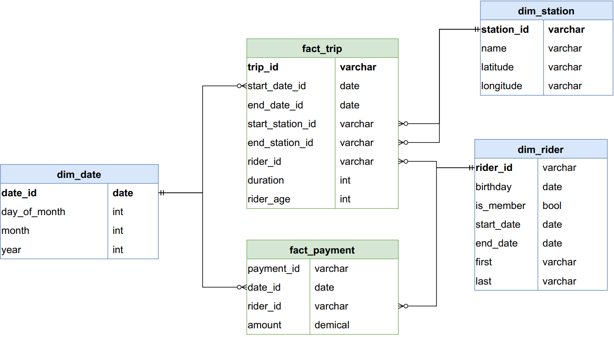

# Divvy Bikeshare Data Lakehouse Project

## Table of Contents
1. [Project Overview](#project-overview)
2. [Goal of the Project](#goal-of-the-project)
3. [ERD](#erd)
4. [Business Outcomes Addressed](#business-outcomes-addressed)
5. [Star Schema Design](#star-schema-design)
6. [Solution Architecture](#solution-architecture)
7. [Tools and Technologies](#tools-and-technologies)
8. [How to Use This Repository](#how-to-use-this-repository)
9. [Future Work](#future-work)

## Project Overview
This project implements a data lake solution for Divvy Bikeshare, a bike-sharing program in Chicago, Illinois, USA. Riders can purchase a pass at kiosks or use a mobile application to unlock bikes at stations around the city. The bikes can be returned to the same or a different station.

The City of Chicago makes anonymized bike trip data publicly available, enabling projects like this to analyze and gain insights into bikeshare usage. This project leverages **Azure Databricks** and the **Lakehouse architecture** to process and analyze the Divvy data.

## Goal of the Project
The primary goal is to develop a robust data lake solution using **Azure Databricks** with the following objectives:

1. Design and implement a **star schema** to address key business outcomes.
2. Build **Bronze, Silver, and Gold layers** in the Lakehouse architecture to process and curate data.

## ERD

This diagram represents the **ERD** for the Divvy Bikeshare data model. It outlines the relationships between the `Rider`, `Trip`, `Payment`, and `Station` tables, which form the basis for the Bronze, Silver, and Gold layers in this project. Each table is used to support the design of the star schema and solve key business outcomes.

## Business Outcomes Addressed
1. **Analyze how much time is spent per ride**
    - Based on date and time factors such as day of week and time of day
    - Based on which station is the starting and / or ending station
    - Based on age of the rider at time of the ride
    - Based on whether the rider is a member or a casual rider
2. **Analyze how much money is spent**
    - Per month, quarter, year
    - Per member, based on the age of the rider at account start

## Star Schema Design

The star schema is designed to address the business outcomes outlined above. It consists of the following tables:

- **Fact Table**:
  - ****fact_trip****: Stores measures relate to time, location, duration and rider.
  - ****fact_payment****: Stores measures ralate to revenue.

- **Dimension Tables**:
  - **dim_riders**: Demographic and membership details of riders.
  - **dim_stations**: Details of bike stations, including location.
  - **dim_dates**: Date-related attributes for time-based analysis.
  - **dim_payments**: Transaction details, such as amount and payment date.

Refer to the ERD diagram in the repository for a visual representation of the schema.

---

## Solution Architecture
This project uses the **Lakehouse architecture**, consisting of the following layers:

1. **Bronze Layer**:
   - Raw data ingestion from CSV files into **Delta Lake**.
   - Data is stored as-is to retain its original structure.

2. **Silver Layer**:
   - Cleaned and enriched data with transformations.

3. **Gold Layer**:
   - Fully transformed, business-ready data modeled in a **star schema**.
   - Includes:
     - **Fact table** for ride and revenue metrics.
     - **Dimension tables** for riders, stations, dates, and payments.

---

## Tools and Technologies
- **Azure Databricks**: For data processing and transformation.
- **Delta Lake**: For efficient and reliable data storage.
- **Spark SQL**: For data transformations and modeling.
- **Python**: For data engineering scripts.

---

## How to Use This Repository
1. Clone this repository to your local environment.
2. Use the notebooks provided in the `notebooks/` directory to:
   - Ingest data into the Bronze layer.
   - Transform data in the Silver layer.
   - Build the star schema in the Gold layer.
3. Review the provided ERD and star schema design for reference.

---

## Future Work
- Implement analytics and machine learning models for predictive insights.

